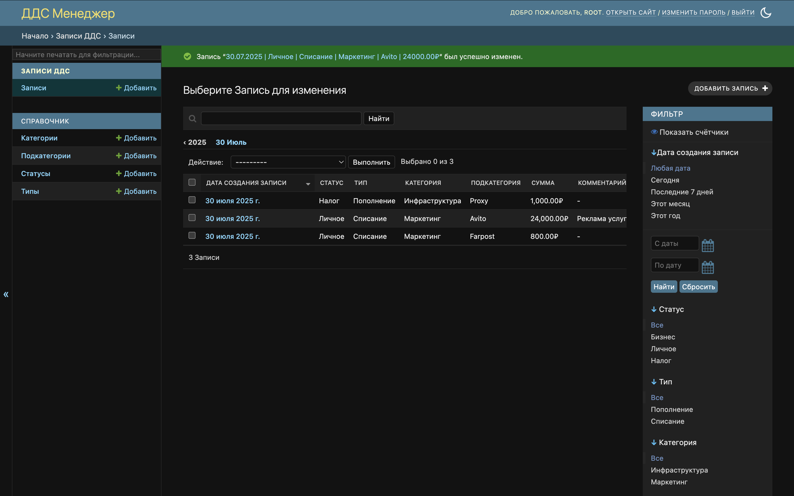
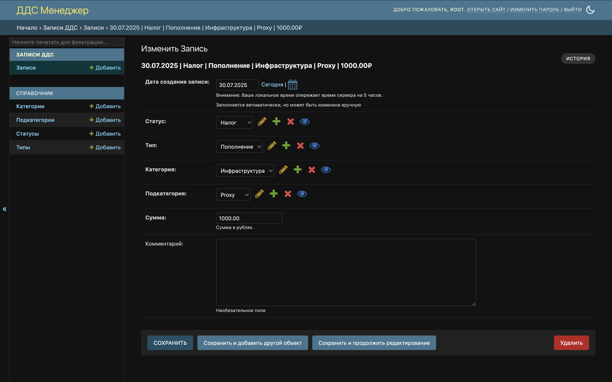

# DDS Manager

A web-based cash flow management application that allows users to track, categorize, and analyze financial transactions.
Built using Django and PostgreSQL, the application leverages Django Admin to provide a fast and intuitive interface.



# Navigation

- [Application Description](#application-description)
- [Environment Configuration](#environment-configuration)
- [Running the Application](#running-the-application)

# Application Description

Cash Flow refers to the process of tracking and analyzing all financial transactions, both income and expenses. This
application allows users to manage and view cash flow operations by providing a clear structure of statuses, types,
categories, and subcategories.



## Technology Stack

* **Backend:** Python 3.11, Django 5
* **Database:** PostgreSQL 17 (Dockerized)
* **Frontend:** Django Admin (with Smart Selects)
* **Deployment:** Docker & Docker Compose
* **Reverse Proxy & Static Serving:** Nginx

# Environment Configuration

| Parameter     | Description                          | Default value |
|---------------|--------------------------------------|---------------|
| `DB_NAME`     | PostgreSQL database name             | `dds_manager` |
| `DB_USER`     | Database user                        | `postgres`    |
| `DB_PASSWORD` | Database user password               | `postgres`    |
| `DB_HOST`     | Database host (usually service name) | `postgres`    |
| `DB_PORT`     | Database port                        | `5432`        |

> [!WARNING]\
> Before starting the application, copy `.env.template` to `.env` and fill in the values.

# Running the Application

1. Clone the repository:
   ```sh
   git clone git@github.com:cyrilcon/dds-manager.git
   ```

2. Navigate to the project directory:
   ```sh
   cd dds-manager
   ```

3. Create .env file.

> [!NOTE]\
> Each `.env` parameter is described in the [environment configuration](#environment-configuration) section.

4. Build and start Docker containers:
   ```sh
   docker-compose up --build -d
   ```

5. Collect static files:
   ```sh
   docker-compose exec django python manage.py collectstatic --noinput
   ```

6. Create a superuser for Django admin access:
   ```sh
   docker-compose exec django python manage.py createsuperuser
   ```

7. (Optional) Load initial fixture data for reference catalogs:
   ```sh
   docker-compose exec django python manage.py loaddata catalogs/fixtures/catalog_data.json
   ```

Once running, the application will be accessible at http://localhost, automatically redirecting to the Django admin
interface.

Enter the username and password you specified when creating the superuser in step 6 to log in.
